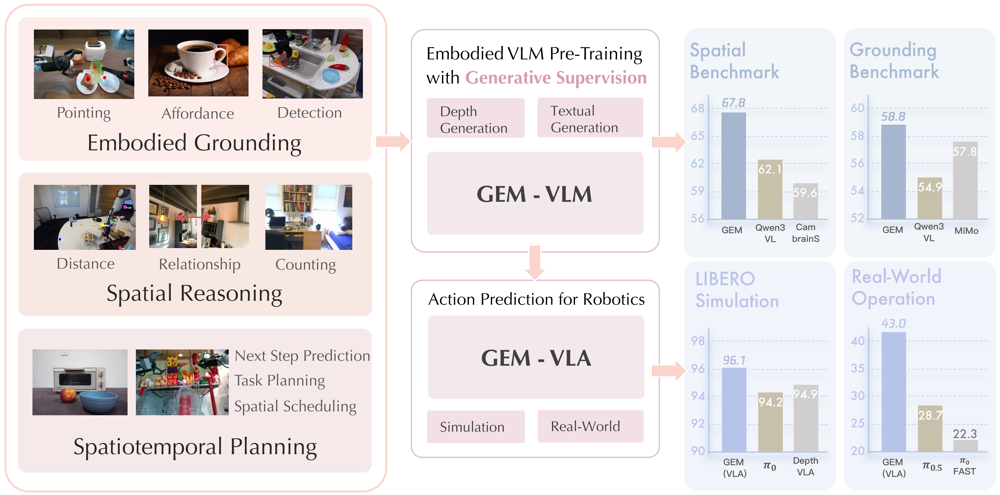

<p align="center">
  <h3 align="center"><strong>GEM: Generative Supervision Helps Embodied Intelligence</strong></h3>
</p>
<p align="center">
    <a href="https://zhaorw02.github.io/">Ruowen Zhao</a><sup>1</sup>,
    Bangguo Li<sup>1</sup>,
    <a href="https://liuzuyan.github.io/">Zuyan Liu</a><sup>1,2,†</sup>,
     Yinan Liang<sup>1</sup>,
    <a href="https://jamesyjl.github.io/">Junliang Ye</a><sup>1</sup>,
    <a href="https://liuff19.github.io/">Fangfu Liu</a><sup>1</sup>,
  <br>                             
   Diankun Wu<sup>1</sup>,
  <a href="https://thuwzy.github.io/">Zhengyi Wang</a><sup>1</sup>,
    <a href="https://yuxumin.github.io/">Xumin Yu</a><sup>2</sup>,
     <a href="https://raoyongming.github.io/">Yongming Rao</a><sup>2,✉</sup>,
   <a href="https://ancientmooner.github.io/">Han Hu</a><sup>2</sup>,
    <a href="https://ml.cs.tsinghua.edu.cn/~jun/index.shtml">Jun Zhu</a><sup>1,✉</sup>
  <br>
    <sup>†</sup>Project Lead.<sup>✉</sup>Corresponding Author.
  <br>
    <sup>1</sup>Tsinghua University,
    <sup>2</sup>Tencent Hunyuan
</p>

<div align="center">

<a href='https://arxiv.org/abs/2605.28548'></a> &nbsp;&nbsp;&nbsp;&nbsp;
 <a href='https://zhaorw02.github.io/GEM/'></a> &nbsp;&nbsp;&nbsp;&nbsp;
 <a></a> &nbsp;&nbsp;&nbsp;&nbsp;
<a href='https://huggingface.co/zzzrw/GEM-2B'></a> &nbsp;&nbsp;&nbsp;&nbsp;
<a href='https://huggingface.co/datasets/zzzrw/GEM-250K'></a>

</div>

https://github.com/user-attachments/assets/e978726f-d2ab-46af-8513-eb0a62a94ecc

## Overview

**Overview of GEM.** GEM enhances semantic reasoning and physical grounding with an auxiliary depth-generation objective. Trained on the large-scale embodied data, GEM achieves strong performance across diverse embodied benchmarks. The extending GEM-VLA also attains SOTA results on simulation and real-world robot tasks.

## News

- **[05/28]** 🔥 We release the paper on [arXiv](https://arxiv.org/abs/2605.28548)!
- **[05/28]** 🔥 We release the training code and dataset samples **GEM-250K**.
- **[05/28]** 🔥 We release the checkpoint of GEM-2B.

## TODO

- [ ] Release of larger model (GEM-8B).
- [ ] Release of full training data.


## Installation
### 1. Clone Repository
```
git clone https://github.com/zhaorw02/GEM.git 
cd GEM
```
### 2. Environment Setup

We use conda to manage the environment. Recommended versions:

- Python 3.10+
- `torch>=2.6.0`, `torchvision`, `transformers>=4.57.0`
- `deepspeed`, `flash-attn`, `accelerate`, `peft`, `triton`, `torchcodec`

```bash
conda create -n gem python=3.12 -y
conda activate gem
pip install -r requirements.txt
pip install flash-attn --no-build-isolation
```

### 3. Dataset Setup

Please configure the dataset paths in `qwen-vl-finetune/qwenvl/data/__init__.py`. Specifically, set `annotation_path` and `data_path` for **GEM-250K**, which can be downloaded from Hugging Face: [GEM-250K](https://huggingface.co/datasets/zzzrw/GEM-250K).

You also need to update the depth image path and the depth image loading logic in `qwen-vl-finetune/qwenvl/data/utils.py` according to your local directory structure.


## Model Checkpoints

The pretrained GEM-2B checkpoint is available on Hugging Face: 🤗 [GEM-2B](https://huggingface.co/zzzrw/GEM-2B/).

<!-- | model name               |    type     | download                                                                                   
| ------------------------ | :---------: | ------------------------------------------------------------------------------------------ | 
| GEM-2B |   huggingface   | 🤗 [HF link](https://huggingface.co/zzzrw/GEM-2B/tree/main) 
| GEM-8B       | huggingface | ---    -->

## VLM Training


Set in `qwen-vl-finetune/train.sh`:
   - `MODEL_PATH`: path to pretrained checkpoints.
   - `OUTPUT_DIR`: where to save checkpoints.

Edit `annotation_path` and `data_path` (after downloading from [GEM-250K](https://huggingface.co/datasets/zzzrw/GEM-250K)) in `qwen-vl-finetune/qwenvl/data/__init__.py`.

From the `qwen-vl-finetune/` directory:

  ```bash
  cd qwen-vl-finetune
  # 8 GPUs by default; set NPROC_PER_NODE or CUDA_VISIBLE_DEVICES as needed
  bash scripts/train.sh
  ```

## VLM Inference
Run inference with the following commands:
```bash
cd qwen-vl-finetune
python inference.py
```

## VLA Training
Please refer to [GEM-VLA](./GEM-VLA/README.md) for details.
           
## BibTeX
If you find our work helpful, please consider citing:
```
@misc{zhao2026gemgenerativesupervisionhelps,
  title={GEM: Generative Supervision Helps Embodied Intelligence}, 
  author={Ruowen Zhao and Bangguo Li and Zuyan Liu and Yinan Liang and Junliang Ye and Fangfu Liu and Diankun Wu and Zhengyi Wang and Xumin Yu and Yongming Rao and Han Hu and Jun Zhu},
  year={2026},
  eprint={2605.28548},
  archivePrefix={arXiv},
  primaryClass={cs.CV},
  url={https://arxiv.org/abs/2605.28548}, 
}
```

## Acknowledgement
Our code is based on these wonderful repos: [Qwen3-VL](https://github.com/QwenLM/Qwen3-VL), [Sana](https://github.com/NVlabs/Sana), [RDT2](https://github.com/thu-ml/RDT2)

<!-- Also we invite you to explore our latest work [Hunyuan-Embodied] -->
